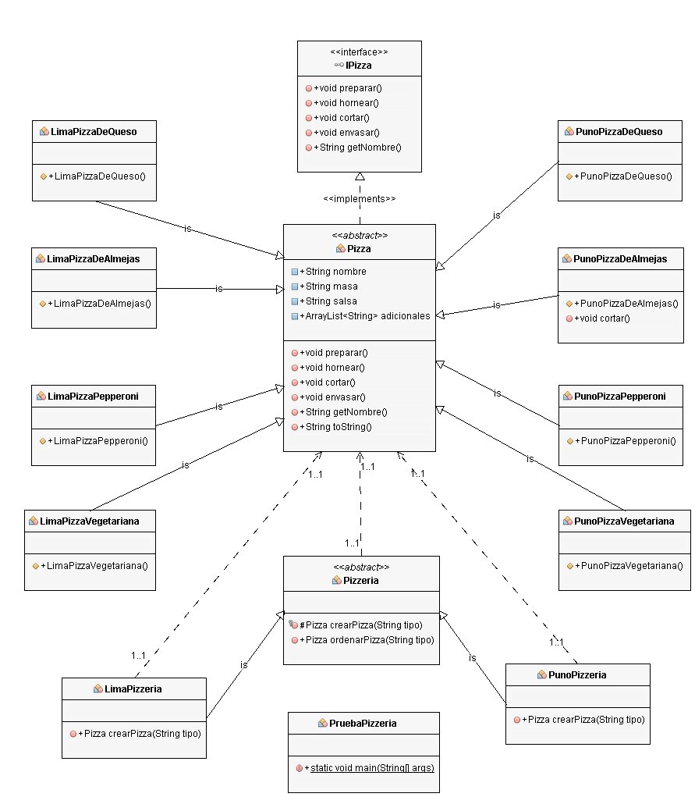

# Factory Method de Pizzas



Output

```bash
Preparando pedido de Pizza de Queso
---- Pizza de Queso ----
Corteza regular
Salsa de tomate
Queso Mozzarella
Queso rallado Parmesano

Hornear por 25 minutos a 160 grados Pizza de Queso
Cortar la pieza en rebanadas diagonales Pizza de Queso
Envasar la pizza en su caja respectiva Pizza de Queso
Orden completada de Pizza de Queso

Preparando pedido de Pizza Vegetariana
---- Pizza Vegetariana ----
Corteza delgada
Salsa de tomate
Mozzarella rallada
Cebolla picada
Rodajas redondas de champiñones
Rodajas redondas de pimiento rojo
Aceitunas

Hornear por 25 minutos a 160 grados Pizza Vegetariana
Cortar la pieza en rebanadas diagonales Pizza Vegetariana
Envasar la pizza en su caja respectiva Pizza Vegetariana
Orden completada de Pizza Vegetariana

Preparando pedido de Pizza de Almejas
---- Pizza de Almejas ----
Corteza delgada
Salsa de ajo
Queso Parmesano
Almejas

Hornear por 25 minutos a 160 grados Pizza de Almejas
Cortar la pieza en rebanadas diagonales Pizza de Almejas
Envasar la pizza en su caja respectiva Pizza de Almejas
Orden completada de Pizza de Almejas

Preparando pedido de Pizza de Pepperoni
---- Pizza de Pepperoni ----
Corteza regular
Salsa de barbacoa
Rodajas de Pepperoni
Queso Parmesano
Rodajas de Ajo

Hornear por 25 minutos a 160 grados Pizza de Pepperoni
Cortar la pieza en rebanadas diagonales Pizza de Pepperoni
Envasar la pizza en su caja respectiva Pizza de Pepperoni
Orden completada de Pizza de Pepperoni

Preparando pedido de Pizza de Queso
---- Pizza de Queso ----
Corteza regular
Salsa de tomate
Queso rallado Mozzarella
Queso Parmesano

Hornear por 25 minutos a 160 grados Pizza de Queso
Cortar la pieza en rebanadas diagonales Pizza de Queso
Envasar la pizza en su caja respectiva Pizza de Queso
Orden completada de Pizza de Queso

Preparando pedido de Pizza Vegetariana
---- Pizza Vegetariana ----
Corteza delgada
Salsa de tomate
Parmesano rallada
Cebolla picada
Rodajas redondas de champiñones
Rodajas redondas de pimiento rojo
Rodajas de cebolla

Hornear por 25 minutos a 160 grados Pizza Vegetariana
Cortar la pieza en rebanadas diagonales Pizza Vegetariana
Envasar la pizza en su caja respectiva Pizza Vegetariana
Orden completada de Pizza Vegetariana

Preparando pedido de Pizza de Almejas
---- Pizza de Almejas ----
Corteza delgada
Salsa de ajo
Queso Parmesano
Almejas

Hornear por 25 minutos a 160 grados Pizza de Almejas
Cortar la pieza en rebanadas triangulares Pizza de Almejas
Envasar la pizza en su caja respectiva Pizza de Almejas
Orden completada de Pizza de Almejas

Preparando pedido de Pizza de Pepperoni
---- Pizza de Pepperoni ----
Corteza regular
Salsa de barbacoa
Rodajas de Pepperoni
Queso Parmesano
Rodajas de Ajo
Rodajas de Cebolla

Hornear por 25 minutos a 160 grados Pizza de Pepperoni
Cortar la pieza en rebanadas diagonales Pizza de Pepperoni
Envasar la pizza en su caja respectiva Pizza de Pepperoni
Orden completada de Pizza de Pepperoni
```

:octocat: [Check more about Java.](https://github.com/FernandoCalmet/Java)

[](https://ko-fi.com/T6T41JKMI)
