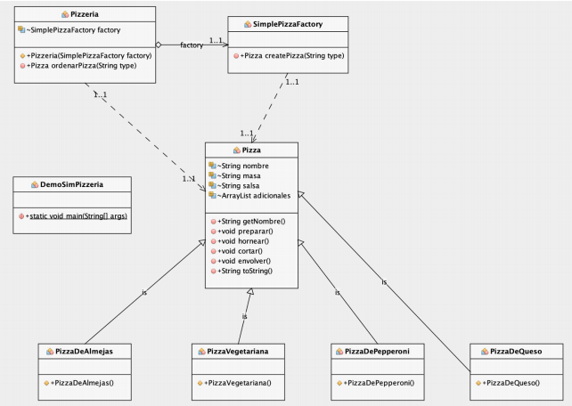

# Simple Pizzeria Factory Method



Output

```bash
BIENVENIDOS A LA PIZZERIA

Preparando Pizza de Queso  
Horneando Pizza de Queso
Cortando Pizza de Queso
Envolviendo Pizza de Queso
Su orden es: Pizza de Queso
---- Pizza de Queso ----
Masa de corteza delgada
Salsa de tomate
Queso Mozarella fresca
Queso parmesano

Preparando Pizza Vegetariana
Horneando Pizza Vegetariana
Cortando Pizza Vegetariana
Envolviendo Pizza Vegetariana
Su orden es: Pizza Vegetariana
---- Pizza Vegetariana ----
Masa de corteza regular
Salsa roja de pizza
Mozzarella triturada
Parmesano gratinado
Cebolla picada
Champiñones picados
Pimenton picado
Aceitunas picadas
```

:octocat: [Check more about Java.](https://github.com/FernandoCalmet/Java)

[](https://ko-fi.com/T6T41JKMI)
