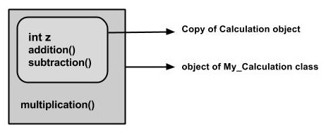

# Herencia

La herencia se puede definir como el proceso en el que una clase adquiere las propiedades (métodos y campos) de otra. Con el uso de la herencia, la información se hace manejable en un orden jerárquico.

La clase que hereda las propiedades de otro se conoce como subclase (clase derivada, clase secundaria) y la clase cuyas propiedades se heredan se conoce como superclase (clase base, clase principal).

## Palabra clave Extends

extiende es la palabra clave utilizada para heredar las propiedades de una clase. A continuación se muestra la sintaxis de la palabra clave extensions.

### Extends Sintaxis

```java
class Super {
   //code block
class Sub extends Super {
   //code block
}
```

### Código de muestra de Herencia

A continuación se muestra un ejemplo que demuestra la herencia de Java. En este ejemplo, puede observar dos clases, a saber, Cálculo y Mi_Cálculo.

Usando la palabra clave extiende, My_Calculation hereda los métodos de suma () y Resta () de la clase de cálculo.

Copie y pegue el siguiente programa en un archivo con el nombre My_Calculation.java

> Ejemplo

```java
public class Calculation {
    int z;

    public void addition(int x, int y) {
        z = x + y;
        System.out.println("The sum of the given numbers:"+z);
    }

    public void Subtraction(int x, int y) {
        z = x - y;
        System.out.println("The difference between the given numbers:"+z);
    }
}
public class MyCalculation extends Calculation {
    public void multiplication(int x, int y) {
        z = x * y;
        System.out.println("The product of the given numbers:" + z);
    }

    public static void main(String args[]) {
        int a = 20, b = 10;
        My_Calculation demo = new MyCalculation();
        demo.addition(a, b);
        demo.Subtraction(a, b);
        demo.multiplication(a, b);
    }
}
```

Compile y ejecute el código anterior como se muestra a continuación.

```bash
javac My_Calculation.java
java My_Calculation
```

Después de ejecutar el programa, producirá el siguiente resultado:

> Salida

```note
The sum of the given numbers:30
The difference between the given numbers:10
The product of the given numbers:200
```

En el programa dado, cuando se crea un objeto para la clase **My_Calculation**, se realiza una copia del contenido de la superclase dentro de él. Por eso, usando el objeto de la subclase puedes acceder a los miembros de una superclase.



La variable de referencia de la superclase puede contener el objeto de la subclase, pero usando esa variable puede acceder solo a los miembros de la superclase, por lo que para acceder a los miembros de ambas clases se recomienda crear siempre una variable de referencia a la subclase.

Si considera el programa anterior, puede crear una instancia de la clase como se indica a continuación. Pero usando la variable de referencia de superclase (**cal** en este caso) no puede llamar al método multiplication (), que pertenece a la subclase **My_Calculation**.

```java
Calculation demo = new My_Calculation();
demo.addition(a, b);
demo.Subtraction(a, b);
```

> Nota: una subclase hereda todos los miembros (campos, métodos y clases anidadas) de su superclase. Los constructores no son miembros, por lo que no son heredados por subclases, pero el constructor de la superclase puede invocarse desde la subclase.

## La palabra clave súper

La súper palabra clave es similar a esta palabra clave. A continuación se muestran los escenarios en los que se utiliza la palabra clave super.

- Se utiliza para diferenciar los miembros de la superclase de los miembros de la subclase, si tienen los mismos nombres.

- Se utiliza para invocar el constructor de superclase de subclase.

### Diferenciar a los miembros

Si una clase hereda las propiedades de otra clase. Y si los miembros de la superclase tienen los mismos nombres que la subclase, para diferenciar estas variables usamos super palabra clave como se muestra a continuación.

```java
super.variable
super.method();
```

### Código de muestra de Super

Esta sección le proporciona un programa que demuestra el uso de la palabra clave **super**.

En el programa dado, tiene dos clases, a saber, Sub_class y Super_class, ambas tienen un método llamado display () con diferentes implementaciones y una variable llamada num con diferentes valores. Estamos invocando el método display () de ambas clases e imprimiendo el valor de la variable num de ambas clases. Aquí puede observar que hemos usado super palabra clave para diferenciar los miembros de superclase de subclase.

Copie y pegue el programa en un archivo con el nombre **Sub_class.java**.

> Ejemplo

```java
public class SuperClass {
    int num = 20;

    // display method of superclass
    public void display() {
        System.out.println("This is the display method of superclass");
    }
}
public class SubClass extends SuperClass {
    int num = 10;

    // display method of sub class
    public void display() {
        System.out.println("This is the display method of subclass");
    }

    public void my_method() {
        // Instantiating subclass
        Sub_class sub = new SubClass();

        // Invoking the display() method of sub class
        sub.display();

        // Invoking the display() method of superclass
        super.display();

        // printing the value of variable num of subclass
        System.out.println("value of the variable named num in sub class:" + sub.num);

        // printing the value of variable num of superclass
        System.out.println("value of the variable named num in super class:" + super.num);
    }

    public static void main(String args[]) {
        Sub_class obj = new SubClass();
        obj.my_method();
    }
}
```

Compile y ejecute el código anterior usando la siguiente sintaxis.

```bash
javac Super_Demo
java Super
```

Al ejecutar el programa, obtendrá el siguiente resultado:

> Salida

```note
This is the display method of subclass
This is the display method of superclass
value of the variable named num in sub class:10
value of the variable named num in super class:20
```

## Invocando al constructor de superclase

Si una clase hereda las propiedades de otra clase, la subclase adquiere automáticamente el constructor predeterminado de la superclase. Pero si desea llamar a un constructor parametrizado de la superclase, debe usar la palabra clave super como se muestra a continuación.

```java
super(values);
```

## Código de muestra de SuperClase

El programa proporcionado en esta sección demuestra cómo usar la palabra clave super para invocar el constructor parametrizado de la superclase. Este programa contiene una superclase y una subclase, donde la superclase contiene un constructor parametrizado que acepta un valor entero, y usamos la palabra clave super para invocar el constructor parametrizado de la superclase.

Copie y pegue el siguiente programa en un archivo con el nombre Subclass.java

> Ejemplo

```java
public class SuperClassConstructor {
    int age;

    SuperClassConstructor(int age) {
        this.age = age;
    }

    public void getAge() {
        System.out.println("The value of the variable named age in super class is: " + age);
    }
}
public class SubClassConstructor extends SuperClassConstructor {
    SubClassConstructor(int age) {
        super(age);
    }

    public static void main(String args[]) {
        SubClassConstructor s = new SubClassConstructor(24);
        s.getAge();
    }
}
```

Compile y ejecute el código anterior usando la siguiente sintaxis.

```bash
javac Subclass
java Subclass
```

Al ejecutar el programa, obtendrá el siguiente resultado:

> Salida

```note
The value of the variable named age in super class is: 24
```

## Relación IS-A

IS-A es una forma de decir: este objeto es un tipo de ese objeto. Veamos cómo se usa la palabra clave extiende para lograr la herencia.

```java
public class Animal {
    //code block
}

public class Mammal extends Animal {
    //code block
}

public class Reptile extends Animal {
    //code block
}

public class Dog extends Mammal {
    //code block
}
```

Ahora, según el ejemplo anterior, en términos orientados a objetos, lo siguiente es cierto:

- Animal es la superclase de la clase Mammal.
- Animal es la superclase de la clase Reptile.
- Mamíferos y reptiles son subclases de la clase Animal.
- El perro es la subclase de las clases de mamíferos y animales.

Ahora, si consideramos la relación IS-A, podemos decir:

- Mamífero IS-A Animal
- Reptil IS-A Animal
- Perro IS-A Mamífero
- Por lo tanto: el perro también es un animal
- Con el uso de la palabra clave extensions, las subclases podrán heredar todas las propiedades de la superclase excepto las propiedades privadas de la superclase.

Podemos asegurar que Mammal es en realidad un Animal con el uso del operador de instancia.

> Ejemplo

```java
class Animal {
}

class Mammal extends Animal {
}

class Reptile extends Animal {
}

public class Dog extends Mammal {
   public static void main(String args[]) {
      Animal a = new Animal();
      Mammal m = new Mammal();
      Dog d = new Dog();

      System.out.println(m instanceof Animal);
      System.out.println(d instanceof Mammal);
      System.out.println(d instanceof Animal);
   }
}
```

Esto producirá el siguiente resultado:

> Salida

```note
true
true
true
```

Como tenemos un buen conocimiento de la palabra clave extiende, veamos cómo se usa la palabra clave implements para obtener la relación IS-A.

Generalmente, la palabra clave implements se usa con clases para heredar las propiedades de una interfaz. Las interfaces nunca pueden ser extendidas por una clase.

> Ejemplo

```java
public interface Animal {
}

public class Mammal implements Animal {
}

public class Dog extends Mammal {
}
```

## La palabra clave instanceof

Usemos el operador **instanceof** para verificar si Mammal es en realidad un Animal y si el perro es en realidad un Animal.

> Ejemplo

```java
Live Demo
interface Animal{}
class Mammal implements Animal{}

public class Dog extends Mammal {

   public static void main(String args[]) {
      Mammal m = new Mammal();
      Dog d = new Dog();

      System.out.println(m instanceof Animal);
      System.out.println(d instanceof Mammal);
      System.out.println(d instanceof Animal);
   }
}
```

Esto producirá el siguiente resultado:

> Salida

```note
true
true
true
```

## Relación HAS-A

Estas relaciones se basan principalmente en el uso. Esto determina si una determinada clase TIENE una determinada cosa. Esta relación ayuda a reducir la duplicación de código y los errores.

Veamos un ejemplo:

> Ejemplo

```java
public class Vehicle{}
public class Speed{}

public class Van extends Vehicle {
   private Speed sp;
}
```

Esto muestra que la clase Van HAS-A Speed. Al tener una clase separada para Speed, no tenemos que poner todo el código que pertenece a Speed dentro de la clase Van, lo que hace posible reutilizar la clase Speed en múltiples aplicaciones.

En la función Orientada a objetos, los usuarios no necesitan preocuparse por qué objeto está haciendo el trabajo real. Para lograr esto, la clase Van oculta los detalles de implementación de los usuarios de la clase Van. Entonces, básicamente lo que sucede es que los usuarios le pedirían a la clase Van que realizara una determinada acción y la clase Van hará el trabajo por sí misma o le pedirá a otra clase que realice la acción.

## Tipos de herencia

Existen varios tipos de herencia como se muestra a continuación.


Un hecho muy importante para recordar es que Java no admite herencia múltiple. Esto significa que una clase no puede extenderse a más de una clase. Por lo tanto, seguir es ilegal:

> Ejemplo

```java
public class extends Animal, Mammal{}
```

Sin embargo, una clase puede implementar una o más interfaces, lo que ha ayudado a Java a deshacerse de la imposibilidad de la herencia múltiple.

---

:octocat: [Check more about Java in my repository.](https://github.com/FernandoCalmet/Java)

[](https://ko-fi.com/T6T41JKMI)
